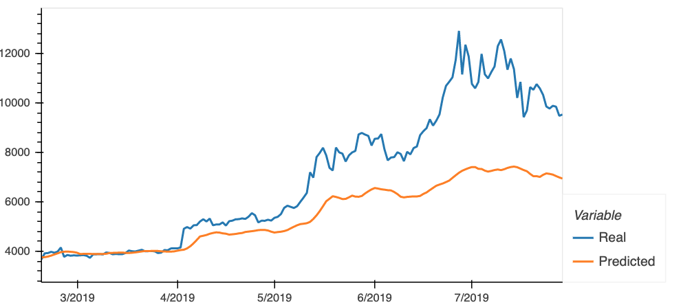
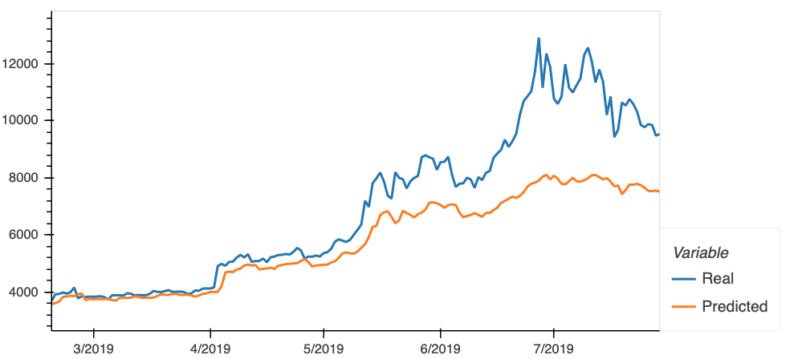

# Homework 14 - Deep Learning

### LSTM Stock Predictor 

Between both models, the closing prices proved to be a stronger feature to predict future prices over the fng indicator. Please see comparison below: 

Loss function: 
FNG as feature: 0.1219 
/nClosing prices as feature: 0.0615

FNG feature predictions:

Closing prices feature predictions:

The lower the window_size, the better the model perform. 

5 window_size: 

2 window_size: 
